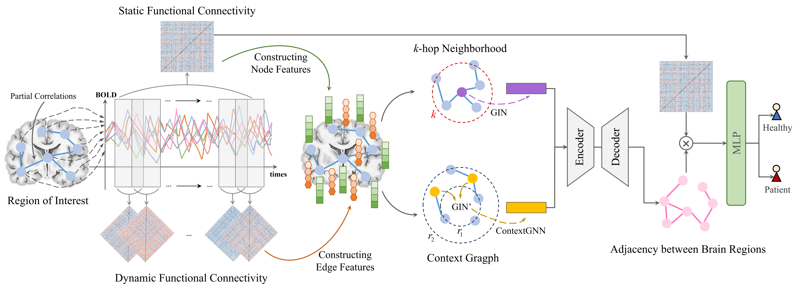

# [NeuroSparse: An Unsupervised Framework for Inferring Brain Connectivity in Autism Diagnosis](https://ieeexplore.ieee.org/document/10822395/authors#authors)
This study has been accepted by BIBM 2024 as a Regular Paper.

## Requirements
torch == 1.12.1; torchvision == 0.13.1; torch-geometric == 2.4.0; scikit-learn; nilearn
## BibTeX

    @inproceedings{yang2024neurosparse,
        title={NeuroSparse: An Unsupervised Framework for Inferring Brain Connectivity in Autism Diagnosis},
        author={Yang, Shuqi and Zhang, Lijuan and Lan, Qing and Ma, Qiujie and Huang, Huan and Miao, Jiaqing and Mou, Shiyu and Luo, Cheng and Yao, Dezhong and Tan, Ying},
        booktitle={2024 IEEE International Conference on Bioinformatics and Biomedicine (BIBM)},
        pages={389--394},
        year={2024},
        organization={IEEE}
    }
